# Multi-Cloud DC-DR Enterprise Deployment Platform

An enterprise-grade, 100% reusable, fully parameterized Multi-Cloud Data Center / Disaster Recovery (DC-DR) Infrastructure, Security Hardening & GitOps CI/CD Promotion Platform targeting **AWS EKS (Primary DC)** and **Azure AKS (Secondary DR)** with **Kubernetes v1.36**.

---

## 🗺️ Call Architecture & File Dependency Map ("Kaun si file kisko call kar rahi hai")

The platform follows a strict 3-tier modular architecture: **Environments (Orchestrator) -> Reusable Modules (Templates) -> Cloud Providers**.

```mermaid
graph TD
    subgraph Root Environment ["Root Execution Tier (terraform/environments/dev)"]
        DEV_MAIN["main.tf (Orchestrator)"]
        DEV_VARS["variables.tf (Input Defaults)"]
        DEV_TFVARS["terraform.tfvars (Config Overrides)"]
        DEV_OUT["outputs.tf (Root Outputs)"]
    end

    subgraph AWS Modules ["AWS Infrastructure Modules (terraform/modules/)"]
        MOD_VPC["vpc (VPC, Subnets, IGW, NAT GWs)"]
        MOD_SG["security_groups (Bastion, App, EKS, RDS, ElastiCache, ALB)"]
        MOD_ALB["alb (ALB, Target Group IP type, SSL Listener)"]
        MOD_EC2["ec2 (Bastion Host, IMDSv2, KMS CMK)"]
        MOD_EKS["eks (EKS Control Plane, OIDC, 3 Managed Node Groups)"]
        MOD_RDS["rds_postgres (PG 17, CMK Encryption, TLS Enforced)"]
    end

    subgraph Azure Modules ["Azure Infrastructure Modules (terraform/modules/)"]
        MOD_VNET["azure_vnet (VNet, Subnets, Dedicated AKS Subnet, NAT GW)"]
        MOD_NSG["azure_nsg (Bastion, App, AKS, DB NSGs)"]
        MOD_APPGW["azure_app_gateway (App Gateway v2, Public IP, AGIC Target)"]
        MOD_VM["azure_vm (Linux VM, SSH TLS Keys, Data Disks)"]
        MOD_AKS["aks (AKS Cluster, Workload Identity, 3 Scale Sets)"]
        MOD_AZPG["azure_postgres (Flexible PG 16/17, CMK, Zone Redundant)"]
    end

    subgraph CI_CD ["CI/CD Container Promotion Pipelines"]
        JENKINS["cicd/Jenkinsfile.promotion"]
        GHA["github/workflows/container-promotion.yml"]
    end

    DEV_MAIN -->|1. Network| MOD_VPC
    DEV_MAIN -->|1. Network| MOD_VNET
    DEV_MAIN -->|2. Security| MOD_SG
    DEV_MAIN -->|2. Security| MOD_NSG
    DEV_MAIN -->|3. Compute| MOD_EC2
    DEV_MAIN -->|3. Compute| MOD_VM
    DEV_MAIN -->|4. Ingress| MOD_ALB
    DEV_MAIN -->|4. Ingress| MOD_APPGW
    DEV_MAIN -->|5. Kubernetes| MOD_EKS
    DEV_MAIN -->|5. Kubernetes| MOD_AKS

    MOD_VPC -->|vpc_id, private_subnet_ids| MOD_SG
    MOD_VPC -->|private_subnet_ids| MOD_EKS
    MOD_VPC -->|public_subnet_ids| MOD_ALB
    MOD_VNET -->|aks_subnet_id| MOD_AKS
    MOD_VNET -->|public_subnet_ids| MOD_APPGW

    JENKINS -->|Promotes Docker Container Tags| MOD_EKS
    GHA -->|Promotes Docker Container Tags| MOD_AKS
```



---

## 🗂️ Project Repository Structure

```
multicloud-dc-dr-deployment/
├── terraform/
│   ├── modules/
│   │   ├── alb/                             # AWS Application Load Balancer (Target Group "ip" type, SSL, HTTP 301 Redirect)
│   │   ├── azure_app_gateway/               # Azure Application Gateway v2 (Standard_v2, Public IP, AGIC Compatible)
│   │   ├── eks/                             # AWS EKS v1.36 Module (OIDC, 3 Subnets, 3 Node Groups: 1 On-Demand, 2 Spot)
│   │   ├── aks/                             # Azure AKS v1.36 Module (Workload Identity, Spot & On-Demand Scale Sets)
│   │   ├── vpc/                             # AWS VPC Module (3 Public, 3 Private Subnets across 3 AZs, 3 NAT GWs)
│   │   ├── azure_vnet/                      # Azure VNet Module (3 Public, 3 Private Subnets, Dedicated AKS Subnet, NAT GW)
│   │   ├── security_groups/                 # AWS Security Groups (Least privilege for EKS, RDS, ElastiCache, ALB, Bastion)
│   │   ├── azure_nsg/                       # Azure NSG Module (Bastion, App, AKS Nodes, DB Subnets)
│   │   ├── ec2/                             # AWS EC2 Instance (Bastion/App, IMDSv2 enforced, KMS CMK EBS encryption)
│   │   ├── azure_vm/                        # Azure Linux VM (TLS SSH Key generation, Data Disks, outputs.tf included)
│   │   ├── rds_postgres/                    # AWS RDS PostgreSQL 17 (KMS CMK EBS Encryption + Forced TLS + Lifecycle protection)
│   │   ├── elasticache_valkey/              # AWS ElastiCache Valkey (KMS CMK + TLS + Multi-AZ)
│   │   ├── s3/                              # AWS S3 Bucket (KMS CMK + Enforced TLS Policy + 3 AZs)
│   │   ├── ecr/                             # AWS ECR (KMS CMK + Scan On Push)
│   │   ├── azure_postgres/                  # Azure PostgreSQL Flexible Server (Zone Redundant HA + CMK + Lifecycle protection)
│   │   ├── azure_redis/                     # Azure Cache for Redis/Valkey (Premium Multi-AZ + TLS 1.2)
│   │   ├── azure_blob_storage/              # Azure Blob Storage (GZRS Multi-AZ + Key Vault CMK + HTTPS)
│   │   ├── acr/                             # Azure Container Registry (Premium + Zone Redundancy + CMK)
│   │   ├── kafka_mm2/                       # Strimzi Kafka Operator & MirrorMaker 2 Module for DC-DR Sync
│   │   └── elasticsearch/                   # ECK Operator & ES Module for Cross-Cluster Replication (CCR)
│   └── environments/
│       └── dev/                             # Dev Environment Module Instantiation (main.tf, variables.tf, outputs.tf, tfvars)
├── ansible/                                 # Ansible OS & Database Security Hardening & DR Orchestration
│   ├── site.yml                             # Master Ansible Playbook
│   ├── inventory/
│   │   └── hosts.ini
│   └── roles/
│       ├── db_hardening/                    # PostgreSQL 17 TLS 1.3 enforcement & pg_hba rules
│       ├── node_hardening/                  # K8s Worker Node CIS kernel hardening
│       └── dr_failover/                     # Automated Multi-Cloud DR Failover Orchestration
├── docker/
│   ├── java-springboot/                     # Java Spring Boot 21 Multi-Arch (amd64/arm64) Dockerfile
│   └── nodejs-app/                          # Node.js 20 Multi-Arch (amd64/arm64) Dockerfile
├── cicd/
│   ├── Jenkinsfile                          # Main 16-Step Build & Deploy Pipeline
│   ├── Jenkinsfile.promotion                # Dedicated Container Promotion Pipeline (DEV -> UAT -> PROD)
│   └── scripts/
│       ├── sbom_generator.sh                # Syft/Trivy SBOM Generation Script
│       └── gitops_update.sh                 # GitOps Repo Image Tag Updater Script
├── .github/workflows/
│   ├── app-promotion-pipeline.yml          # GitHub Actions Application Build & Deploy Workflow
│   ├── container-promotion.yml              # GitHub Actions Dedicated Container Promotion Workflow
│   └── terraform-ci-cd.yml                  # GitHub Actions Terraform CI/CD Workflow
└── gitops/                                  # GitOps Manifests & Kustomize Overlays
    ├── base/
    └── environments/
```

---

## 🔒 Security, Subnet Isolation & Lifecycle Safeguards

1. **Strict Private Subnet Isolation:**
   - EKS Worker Nodes, RDS PostgreSQL, ElastiCache Valkey, AKS Scale Sets, Azure Flexible PostgreSQL, and Azure Redis are deployed strictly inside **Private Subnets**.
   - Public IPs are completely disabled for internal database and cluster worker nodes.
   - Database ingress is limited exclusively to EKS/AKS worker security groups on ports `5432` (PostgreSQL) and `6379` (Valkey/Redis).

2. **Terraform Lifecycle Protection (`lifecycle` blocks):**
   - Stateful and sensitive resources (`aws_db_instance`, `azurerm_postgresql_flexible_server`, `aws_s3_bucket`, `azurerm_storage_account`, `aws_eks_cluster`, `azurerm_kubernetes_cluster`, `azurerm_application_gateway`) incorporate explicit `lifecycle` blocks:
     ```hcl
     lifecycle {
       prevent_destroy = true  # Prevents accidental deletion of database or storage states
       ignore_changes  = [password, latest_restorable_time]
     }
     ```

3. **Ingress & SSL Termination:**
   - **AWS ALB:** Accepts traffic on Port 80, executes a mandatory `HTTP 301 Redirect` to Port 443 (HTTPS), terminates SSL using ACM Certificates, and forwards directly to EKS Pod IPs using `target_type = "ip"` for AWS Load Balancer Controller `TargetGroupBinding`.
   - **Azure Application Gateway v2:** Functions as public ingress for AKS DR cluster with public IP, HTTPS listeners, health probes (`/healthz`), and AGIC (`appgw.ingress.k8s.io`) compatibility.

---

## 🚀 How to Instantiate a New Infrastructure Environment (e.g. UAT or PROD)

All modules in `terraform/modules/` are 100% decoupled and reusable. To create a new environment:

1. Create a new environment directory:
   ```bash
   mkdir -p terraform/environments/uat
   ```
2. Copy configuration files from `dev`:
   ```bash
   cp terraform/environments/dev/main.tf terraform/environments/uat/
   cp terraform/environments/dev/variables.tf terraform/environments/uat/
   cp terraform/environments/dev/locals.tf terraform/environments/uat/
   cp terraform/environments/dev/outputs.tf terraform/environments/uat/
   ```
3. Update `terraform/environments/uat/terraform.tfvars`:
   ```hcl
   environment               = "uat"
   aws_region                = "us-east-1"
   azure_location            = "eastus"
   azure_resource_group      = "rg-multicloud-uat-01"
   vpc_cidr                  = "10.10.0.0/16"
   azure_vnet_cidr           = "10.11.0.0/16"
   bastion_ssh_allowed_cidrs = ["10.200.0.0/16"] # Restricted VPN CIDR
   ```
4. Execute Terraform:
   ```bash
   cd terraform/environments/uat
   terraform init
   terraform apply -auto-approve
   ```

---

## 🚢 Container Promotion Pipelines (Jenkins & GitHub Actions)

### 1. Jenkins Container Promotion (`cicd/Jenkinsfile.promotion`)
- **Trigger:** Manual trigger via Jenkins parameter choice (`UAT` or `PROD`, image tag).
- **Functionality:**
  - Authenticates to AWS ECR and Azure ACR via OIDC.
  - Pulls existing immutable image digest (no source code recompilation).
  - Runs Trivy vulnerability security gate.
  - Re-tags container image for target environment and pushes to both AWS ECR and Azure ACR.
  - Commits updated tag to GitOps repository for Argo CD sync.
  - Enforces explicit interactive approval for `PROD` promotion.

### 2. GitHub Actions Container Promotion (`.github/workflows/container-promotion.yml`)
- **Trigger:** `workflow_dispatch` event in GitHub UI.
- **Functionality:**
  - Leverages GitHub Environments (`uat`, `prod`) to enforce Protection Rules (Required Reviewers & Approval Gates).
  - Performs OIDC token exchange with AWS & Azure.
  - Retags and syncs multi-cloud container images across ECR & ACR.
  - Updates Kustomize image tag in `gitops/environments/<env>` manifest repository.

---

## 🛠️ Quick Execution Commands

### Deploy Infrastructure via Terraform (DEV Environment)
```bash
cd terraform/environments/dev
terraform init
terraform apply -auto-approve
```

### Run Ansible Security Hardening & DR Orchestration
```bash
cd ansible
ansible-playbook -i inventory/hosts.ini site.yml
```
