# Multi-Cloud DC-DR Enterprise Deployment Platform

An enterprise-grade, 100% reusable, fully parameterized Multi-Cloud Data Center / Disaster Recovery (DC-DR) Infrastructure, Security Hardening & GitOps CI/CD Promotion Platform targeting **AWS EKS (Primary DC)** and **Azure AKS (Secondary DR)** with **Kubernetes v1.36**.

---

## 🗺️ File Call Hierarchy & Dependency Flow Map

The platform follows a strict 3-tier modular architecture: **Environments (Orchestrator) -> Reusable Modules (Templates) -> Cloud Providers**.

```mermaid
graph TD
    subgraph Root Environment ["Root Execution Tier (terraform/environments/dev)"]
        DEV_MAIN["main.tf (Orchestrator)"]
        DEV_VARS["variables.tf (Input Defaults)"]
        DEV_TFVARS["terraform.tfvars (Config Overrides)"]
        DEV_OUT["outputs.tf (Root Outputs)"]
    end

    subgraph AWS Modules ["AWS Infrastructure Modules (terraform/modules/)"]
        MOD_VPC["vpc (VPC, Subnets, IGW, NAT GWs)"]
        MOD_SG["security_groups (Bastion, App, EKS, RDS, ElastiCache, ALB)"]
        MOD_ALB["alb (ALB, Target Group IP type, SSL Listener)"]
        MOD_EC2["ec2 (Bastion Host, IMDSv2, KMS CMK)"]
        MOD_EKS["eks (EKS Control Plane, OIDC, 3 Managed Node Groups)"]
        MOD_RDS["rds_postgres (PG 17, CMK Encryption, TLS Enforced)"]
    end

    subgraph Azure Modules ["Azure Infrastructure Modules (terraform/modules/)"]
        MOD_VNET["azure_vnet (VNet, Subnets, Dedicated AKS Subnet, NAT GW)"]
        MOD_NSG["azure_nsg (Bastion, App, AKS, DB NSGs)"]
        MOD_APPGW["azure_app_gateway (App Gateway v2, Public IP, AGIC Target)"]
        MOD_VM["azure_vm (Linux VM, SSH TLS Keys, Data Disks)"]
        MOD_AKS["aks (AKS Cluster, Workload Identity, 3 Scale Sets)"]
        MOD_AZPG["azure_postgres (Flexible PG 16/17, CMK, Zone Redundant)"]
    end

    subgraph CI_CD ["CI/CD Container Promotion Pipelines"]
        JENKINS["cicd/Jenkinsfile.promotion"]
        GHA["github/workflows/container-promotion.yml"]
    end

    DEV_MAIN -->|1. Network| MOD_VPC
    DEV_MAIN -->|1. Network| MOD_VNET
    DEV_MAIN -->|2. Security| MOD_SG
    DEV_MAIN -->|2. Security| MOD_NSG
    DEV_MAIN -->|3. Compute| MOD_EC2
    DEV_MAIN -->|3. Compute| MOD_VM
    DEV_MAIN -->|4. Ingress| MOD_ALB
    DEV_MAIN -->|4. Ingress| MOD_APPGW
    DEV_MAIN -->|5. Kubernetes| MOD_EKS
    DEV_MAIN -->|5. Kubernetes| MOD_AKS

    MOD_VPC -->|vpc_id, private_subnet_ids| MOD_SG
    MOD_VPC -->|private_subnet_ids| MOD_EKS
    MOD_VPC -->|public_subnet_ids| MOD_ALB
    MOD_VNET -->|aks_subnet_id| MOD_AKS
    MOD_VNET -->|public_subnet_ids| MOD_APPGW

    JENKINS -->|Promotes Docker Container Tags| MOD_EKS
    GHA -->|Promotes Docker Container Tags| MOD_AKS
```



---

## 🛠️ Developer Operations & Module Modification Guide

Whenever you modify a specific module or component, execute targeted commands to apply changes safely without affecting unrelated infrastructure:

### 1. Terraform Module-Specific Execution Commands

Always navigate to the active environment directory first:
```bash
cd terraform/environments/dev
```

#### A. AWS VPC Module (`modules/vpc`) Change:
Agar aapne Subnets, NAT Gateways ya Route Tables change kiye hain:
```bash
# 1. Format & Validate
terraform fmt -recursive ../../modules/vpc
terraform validate

# 2. Targeted Plan
terraform plan -target=module.vpc

# 3. Targeted Apply
terraform apply -target=module.vpc -auto-approve
```

#### B. AWS EKS Cluster Module (`modules/eks`) Change:
Agar aapne K8s version, Node Groups, ya Spot/On-Demand instance types change kiye hain:
```bash
# Targeted Plan & Apply for EKS only
terraform plan -target=module.eks_dc_cluster
terraform apply -target=module.eks_dc_cluster -auto-approve
```

#### C. Azure VNet & AKS Cluster Modules (`modules/azure_vnet` / `modules/aks`) Change:
Agar aapne Azure DR VNet ya AKS scale sets modify kiye hain:
```bash
# Targeted Apply for Azure VNet & AKS
terraform plan -target=module.azure_vnet -target=module.aks_dr_cluster
terraform apply -target=module.azure_vnet -target=module.aks_dr_cluster -auto-approve
```

#### D. Load Balancer Modules (`modules/alb` / `modules/azure_app_gateway`) Change:
Agar aapne AWS ALB SSL Cert, Target Group IP routing, ya Azure App Gateway probe change kiya hai:
```bash
# Target AWS ALB
terraform apply -target=module.alb -auto-approve

# Target Azure Application Gateway v2
terraform apply -target=module.azure_app_gateway -auto-approve
```

#### E. Security Groups & NSGs (`modules/security_groups` / `modules/azure_nsg`) Change:
Agar aapne allowed CIDRs, SSH ports, ya Database port rules modify kiye hain:
```bash
terraform apply -target=module.security_groups -target=module.azure_nsg -auto-approve
```

---

### 2. Ansible Role-Specific Execution Commands

Agar aapne kisi specific Ansible security role me change kiya hai:

```bash
cd ansible

# A. Run Database Hardening Role Only (PostgreSQL 17 TLS & pg_hba rules)
ansible-playbook -i inventory/hosts.ini site.yml --tags db_hardening

# B. Run Worker Node CIS Hardening Role Only
ansible-playbook -i inventory/hosts.ini site.yml --tags node_hardening

# C. Run DR Automated Failover Role Only
ansible-playbook -i inventory/hosts.ini site.yml --tags dr_failover
```

---

### 3. Unit Testing & SonarQube Code Coverage Report Matrix

Every application stack includes automated unit test execution and code coverage report generation configured in both Jenkins (`cicd/Jenkinsfile`) and GitHub Actions (`.github/workflows/app-promotion-pipeline.yml`):

| Language / Framework | Unit Test Execution Command | Output Coverage Report | SonarQube Scanner Property |
| :--- | :--- | :--- | :--- |
| **Java Spring Boot** | `mvn clean test jacoco:report` | `target/site/jacoco/jacoco.xml` | `sonar.coverage.jacoco.xmlReportPaths=target/site/jacoco/jacoco.xml` |
| **Node.js / React / Angular** | `npm test -- --coverage` | `coverage/lcov.info` | `sonar.javascript.lcov.reportPaths=coverage/lcov.info` |
| **Python (pytest)** | `pytest --cov=. --cov-report=xml:coverage.xml` | `coverage.xml` | `sonar.python.coverage.reportPaths=coverage.xml` |
| **Golang (go test)** | `go test -v -coverprofile=coverage.out ./...` | `coverage.out` | `sonar.go.coverage.reportPaths=coverage.out` |

Automated Execution Script:
```bash
bash cicd/scripts/run_unit_tests_and_sonar.sh <MICROSERVICE_NAME>
```

---

### 4. Application Dockerfile & Local Build Validation

Whenever you update an application Dockerfile:

```bash
# A. Build & Test Java Spring Boot Image locally
docker build -t java-springboot-service:local ./docker/java-springboot

# B. Build & Test Node.js App locally
docker build -t nodejs-service:local ./docker/nodejs-app

# C. Build & Test Angular/React Frontend locally
docker build -t frontend-service:local ./docker/frontend-app

# D. Build & Test Golang App locally
docker build -t golang-service:local ./docker/golang-app

# E. Build & Test Python App locally
docker build -t python-service:local ./docker/python-app
```

---

### 4. GitOps Manifest Local Validation

Agar aapne Kustomize overlays ya Argo Rollouts manifests modify kiye hain:

```bash
# Validate DEV overlay rendering locally
kustomize build gitops/environments/dev

# Validate PROD overlay rendering locally
kustomize build gitops/environments/prod
```

---

## 🗂️ Project Repository Structure

```
multicloud-dc-dr-deployment/
├── terraform/
│   ├── modules/
│   │   ├── alb/                             # AWS Application Load Balancer (Target Group "ip" type, SSL, HTTP 301 Redirect)
│   │   ├── azure_app_gateway/               # Azure Application Gateway v2 (Standard_v2, Public IP, AGIC Compatible)
│   │   ├── eks/                             # AWS EKS v1.36 Module (OIDC, 3 Subnets, 3 Node Groups: 1 On-Demand, 2 Spot)
│   │   ├── aks/                             # Azure AKS v1.36 Module (Workload Identity, Spot & On-Demand Scale Sets)
│   │   ├── vpc/                             # AWS VPC Module (3 Public, 3 Private Subnets across 3 AZs, 3 NAT GWs)
│   │   ├── azure_vnet/                      # Azure VNet Module (3 Public, 3 Private Subnets, Dedicated AKS Subnet, NAT GW)
│   │   ├── security_groups/                 # AWS Security Groups (Least privilege for EKS, RDS, ElastiCache, ALB, Bastion)
│   │   ├── azure_nsg/                       # Azure NSG Module (Bastion, App, AKS Nodes, DB Subnets)
│   │   ├── ec2/                             # AWS EC2 Instance (Bastion/App, IMDSv2 enforced, KMS CMK EBS encryption)
│   │   ├── azure_vm/                        # Azure Linux VM (TLS SSH Key generation, Data Disks, outputs.tf included)
│   │   ├── rds_postgres/                    # AWS RDS PostgreSQL 17 (KMS CMK EBS Encryption + Forced TLS + Lifecycle protection)
│   │   ├── elasticache_valkey/              # AWS ElastiCache Valkey (KMS CMK + TLS + Multi-AZ)
│   │   ├── s3/                              # AWS S3 Bucket (KMS CMK + Enforced TLS Policy + 3 AZs)
│   │   ├── ecr/                             # AWS ECR (KMS CMK + Scan On Push)
│   │   ├── azure_postgres/                  # Azure PostgreSQL Flexible Server (Zone Redundant HA + CMK + Lifecycle protection)
│   │   ├── azure_redis/                     # Azure Cache for Redis/Valkey (Premium Multi-AZ + TLS 1.2)
│   │   ├── azure_blob_storage/              # Azure Blob Storage (GZRS Multi-AZ + Key Vault CMK + HTTPS)
│   │   ├── acr/                             # Azure Container Registry (Premium + Zone Redundancy + CMK)
│   │   ├── kafka_mm2/                       # Strimzi Kafka Operator & MirrorMaker 2 Module for DC-DR Sync
│   │   └── elasticsearch/                   # ECK Operator & ES Module for Cross-Cluster Replication (CCR)
│   └── environments/
│       └── dev/                             # Dev Environment Module Instantiation (main.tf, variables.tf, outputs.tf, tfvars)
├── ansible/                                 # Ansible OS & Database Security Hardening & DR Orchestration
│   ├── site.yml                             # Master Ansible Playbook
│   ├── inventory/
│   │   └── hosts.ini
│   └── roles/
│       ├── db_hardening/                    # PostgreSQL 17 TLS 1.3 enforcement & pg_hba rules
│       ├── node_hardening/                  # K8s Worker Node CIS kernel hardening
│       └── dr_failover/                     # Automated Multi-Cloud DR Failover Orchestration
├── docker/
│   ├── java-springboot/                     # Java Spring Boot 21 Multi-Arch (amd64/arm64) Dockerfile
│   ├── nodejs-app/                          # Node.js 20 Multi-Arch (amd64/arm64) Dockerfile
│   ├── frontend-app/                        # Angular / React Nginx Unprivileged Alpine Dockerfile
│   ├── golang-app/                          # Go 1.22 Distroless Static Binary Dockerfile
│   └── python-app/                          # Python 3.12 FastAPI/Flask Virtualenv Dockerfile
├── cicd/
│   ├── Jenkinsfile                          # Main 16-Step Build & Deploy Pipeline (Parallel Execution + Parameters)
│   ├── Jenkinsfile.promotion                # Dedicated Container Promotion Pipeline (DEV -> UAT -> PROD)
│   └── scripts/
│       ├── sbom_generator.sh                # Syft/Trivy SBOM Generation Script
│       └── gitops_update.sh                 # GitOps Repo Image Tag Updater Script
├── .github/workflows/
│   ├── app-promotion-pipeline.yml          # GitHub Actions Application Build & Deploy Workflow (Parallel)
│   ├── container-promotion.yml              # GitHub Actions Dedicated Container Promotion Workflow
│   ├── terraform-ci-cd.yml                  # GitHub Actions Terraform CI/CD Workflow
│   └── terraform-drift-detection.yml        # Scheduled Automated Infrastructure Drift Detection Workflow

---

## 🔍 Automated Infrastructure Drift Detection System

To prevent uncommitted manual out-of-band changes in the AWS Console or Azure Portal from diverging from declared Terraform state:

1. **Daily Scheduled Cron Job:** `.github/workflows/terraform-drift-detection.yml` runs automatically every night at Midnight UTC (and via `workflow_dispatch`), executing `terraform plan -detailed-exitcode`.
2. **Exit Code 2 (Drift Triggered):** When exit code is 2 (live cloud resources differ from state):
   - Automatically creates a GitHub Issue tagged `drift-detection` with resource diff details.
   - Triggers an instant Slack alert notification.
3. **Jenkins Scheduled Job:** `cicd/Jenkinsfile.drift-detection` provides an equivalent Jenkins cron trigger (`triggers { cron('0 1 * * *') }`).
4. **Manual CLI Execution Script:**
   ```bash
   bash cicd/scripts/terraform_drift_detection.sh dev
   ```
└── gitops/                                  # GitOps Manifests & Kustomize Overlays
    ├── base/
    └── environments/
```

---

## 🔒 Security, Subnet Isolation, Custom Validations & Lifecycle Safeguards

1. **Enterprise Custom Validation Framework (All 27 Modules):**
   - **Input Schema & Format Validation (`variables.tf`):** Every input variable across all 27 reusable modules includes strict Terraform `validation` blocks enforcing IPv4 CIDR structures (`can(cidrnetmask(...))`), resource regex naming standards, allowed region lists, port ranges (1-65535), and password complexity requirements (>= 12 chars, uppercase, lowercase, numeric).
   - **Runtime Compliance Guards (`main.tf`):** Resources enforce `lifecycle` `precondition` and `postcondition` blocks to validate live infrastructure states:
     - **Security Postconditions:** Enforces `disable_password_authentication == true` (Azure VM), `scan_on_push == true` (AWS ECR), `enable_https_traffic_only == true` (Azure Blob), `http_tokens == "required"` (AWS EC2 IMDSv2), and `minimum_tls_version == "1.2"` (Redis/Valkey).
     - **High Availability Preconditions:** Validates multi-AZ subnet distribution, minimum node counts (`system_node_pool.node_count >= 3` for AKS/EKS and master quorum >= 3 for Elasticsearch).

2. **Strict Private Subnet Isolation:**
   - EKS Worker Nodes, RDS PostgreSQL, ElastiCache Valkey, AKS Scale Sets, Azure Flexible PostgreSQL, and Azure Redis are deployed strictly inside **Private Subnets**.
   - Public IPs are completely disabled for internal database and cluster worker nodes.
   - Database ingress is limited exclusively to EKS/AKS worker security groups on ports `5432` (PostgreSQL) and `6379` (Valkey/Redis).

3. **Terraform Lifecycle Protection (`lifecycle` blocks):**
   - Stateful and sensitive resources (`aws_db_instance`, `azurerm_postgresql_flexible_server`, `aws_s3_bucket`, `azurerm_storage_account`, `aws_eks_cluster`, `azurerm_kubernetes_cluster`, `azurerm_application_gateway`) incorporate explicit `lifecycle` safeguards:
     ```hcl
     lifecycle {
       prevent_destroy = true  # Prevents accidental deletion of database or storage states
       ignore_changes  = [password, latest_restorable_time]
     }
     ```

3. **Ingress & SSL Termination:**
   - **AWS ALB:** Accepts traffic on Port 80, executes a mandatory `HTTP 301 Redirect` to Port 443 (HTTPS), terminates SSL using ACM Certificates, and forwards directly to EKS Pod IPs using `target_type = "ip"` for AWS Load Balancer Controller `TargetGroupBinding`.
   - **Azure Application Gateway v2:** Functions as public ingress for AKS DR cluster with public IP, HTTPS listeners, health probes (`/healthz`), and AGIC (`appgw.ingress.k8s.io`) compatibility.

---

## 🚀 How to Instantiate a New Infrastructure Environment (e.g. UAT or PROD)

All modules in `terraform/modules/` are 100% decoupled and reusable. To create a new environment:

1. Create a new environment directory:
   ```bash
   mkdir -p terraform/environments/uat
   ```
2. Copy configuration files from `dev`:
   ```bash
   cp terraform/environments/dev/main.tf terraform/environments/uat/
   cp terraform/environments/dev/variables.tf terraform/environments/uat/
   cp terraform/environments/dev/locals.tf terraform/environments/uat/
   cp terraform/environments/dev/outputs.tf terraform/environments/uat/
   ```
3. Update `terraform/environments/uat/terraform.tfvars`:
   ```hcl
   environment               = "uat"
   aws_region                = "us-east-1"
   azure_location            = "eastus"
   azure_resource_group      = "rg-multicloud-uat-01"
   vpc_cidr                  = "10.10.0.0/16"
   azure_vnet_cidr           = "10.11.0.0/16"
   bastion_ssh_allowed_cidrs = ["10.200.0.0/16"] # Restricted VPN CIDR
   ```
4. Execute Terraform:
   ```bash
   cd terraform/environments/uat
   terraform init
   terraform apply -auto-approve
   ```

---

## 🚢 Container Promotion Pipelines (Jenkins & GitHub Actions)

### 1. Jenkins Container Promotion (`cicd/Jenkinsfile.promotion`)
- **Trigger:** Manual trigger via Jenkins parameter choice (`UAT` or `PROD`, image tag).
- **Functionality:**
  - Authenticates to AWS ECR and Azure ACR via OIDC.
  - Pulls existing immutable image digest (no source code recompilation).
  - Runs Trivy vulnerability security gate.
  - Re-tags container image for target environment and pushes to both AWS ECR and Azure ACR.
  - Commits updated tag to GitOps repository for Argo CD sync.
  - Enforces explicit interactive approval for `PROD` promotion.

### 2. GitHub Actions Container Promotion (`.github/workflows/container-promotion.yml`)
- **Trigger:** `workflow_dispatch` event in GitHub UI.
- **Functionality:**
  - Leverages GitHub Environments (`uat`, `prod`) to enforce Protection Rules (Required Reviewers & Approval Gates).
  - Performs OIDC token exchange with AWS & Azure.
  - Retags and syncs multi-cloud container images across ECR & ACR.
  - Updates Kustomize image tag in `gitops/environments/<env>` manifest repository.

---

## 🛠️ Quick Execution Commands

### Deploy Infrastructure via Terraform (DEV Environment)
```bash
cd terraform/environments/dev
terraform init
terraform apply -auto-approve
```

### Run Ansible Security Hardening & DR Orchestration
```bash
cd ansible
ansible-playbook -i inventory/hosts.ini site.yml
```
